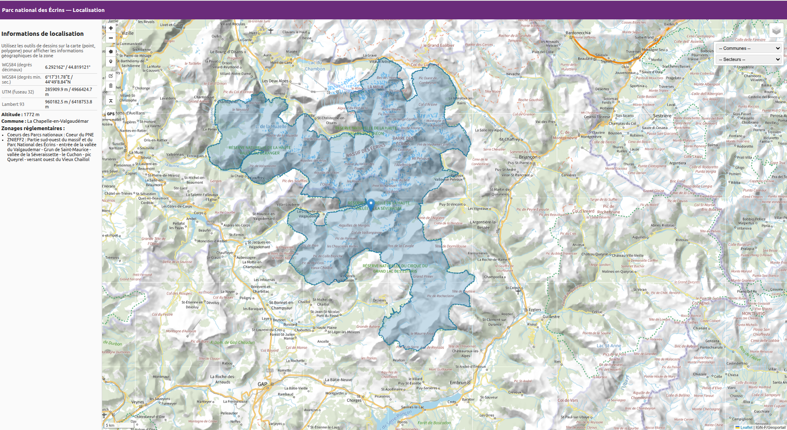

# Application "Localisation" du PNE

Cette application est une simple interface en JS permettant d'afficher une carte et quelques information de localisation et de cartographie :

- import de fichier geographique (geojson, kml, gpx)
- information de quels zonages sont intersectés au clic sur la carte via l'API de GeoNature
- affichage de couche wms, geojson
